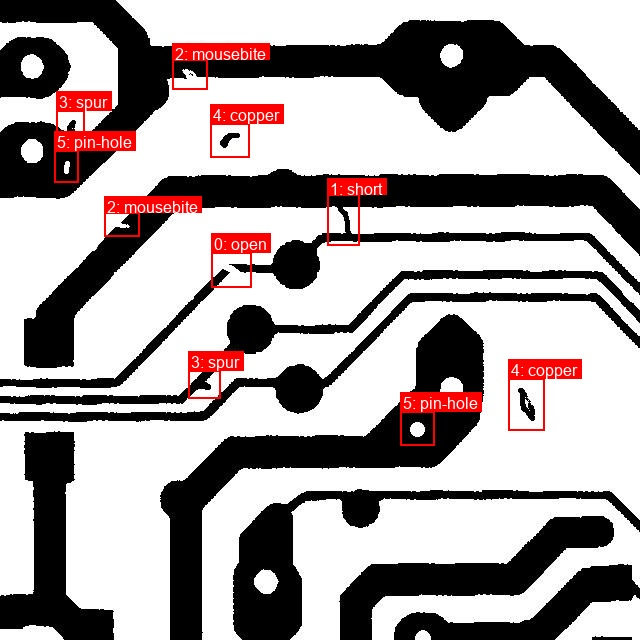
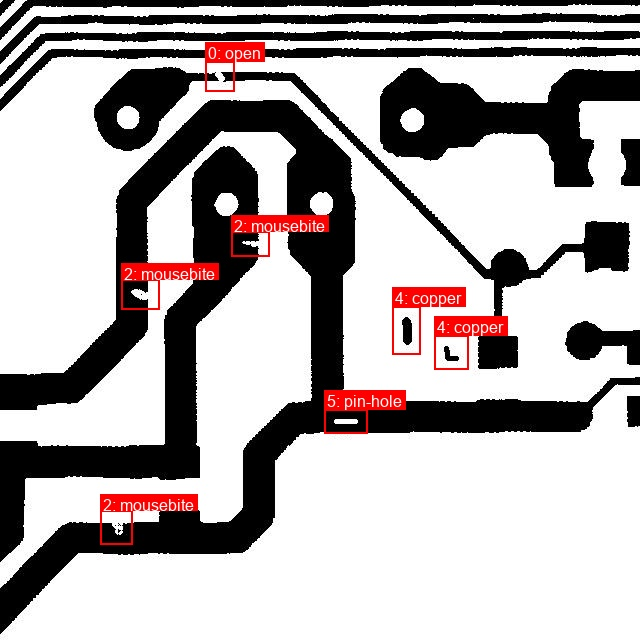
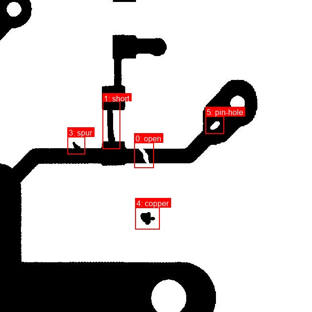
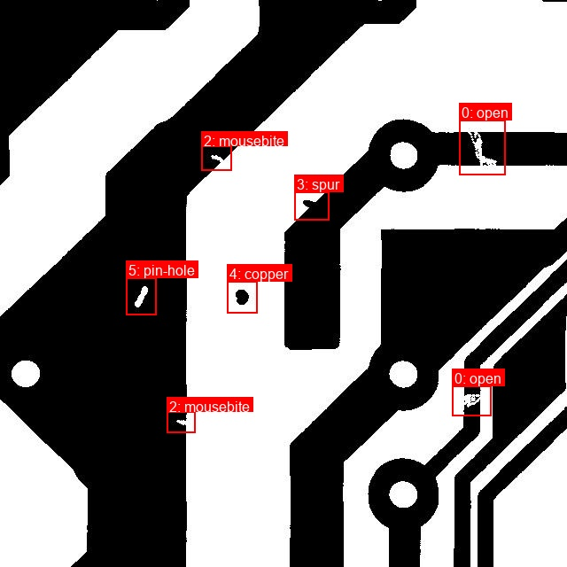
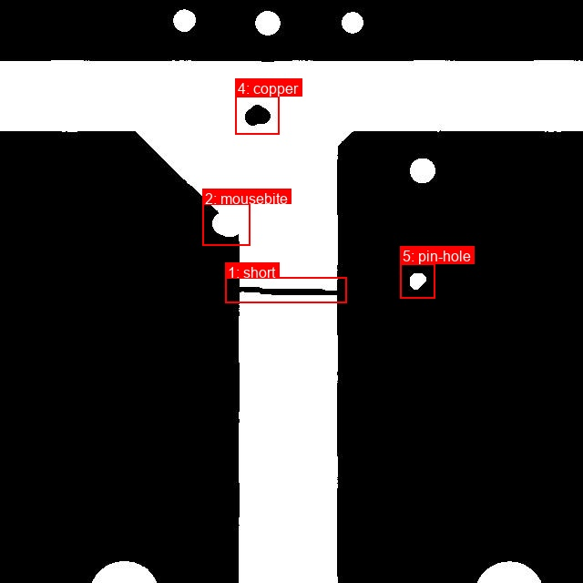
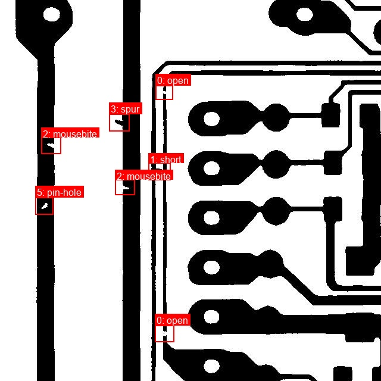

<div align="center">

# ⚡ PCB-YOLO: Real-Time PCB Defect Detection with YOLOv11

[](https://www.python.org/)
[](https://pytorch.org/)
[](https://github.com/ultralytics/ultralytics)
[](https://github.com/tangsanli5201/DeepPCB)
[](LICENSE)

<p align="center">
  <b>An end-to-end, high-performance Automated Optical Inspection (AOI) pipeline for Printed Circuit Board (PCB) surface defect detection powered by YOLOv11.</b>
</p>

[Key Features](#-key-features) •
[Defect Taxonomy](#-defect-taxonomy) •
[Visualizations](#-sample-visualizations) •
[Installation](#-quick-start) •
[Pipeline Workflow](#-pipeline-workflow) •
[Benchmark Results](#-benchmark-results) •
[Project Structure](#-project-structure)

---

</div>

## 📌 Overview

Printed Circuit Board (PCB) quality assurance is a critical step in modern electronic manufacturing. Traditional manual inspection is labor-intensive, error-prone, and slow. 

**PCB-YOLO** provides a production-ready, modular deep learning pipeline built on the state-of-the-art **YOLOv11** architecture. The system accurately detects and localizes micro-defects on bare PCBs (including open circuits, shorts, mousebites, spurs, copper residue, and pin-holes) in real-time.

```
┌─────────────────┐     ┌───────────────────────┐     ┌───────────────────────┐     ┌───────────────────────┐
│ DeepPCB Dataset │ ──> │ YOLO Conversion/Split │ ──> │ YOLOv11 Training Loop │ ──> │ Evaluation & Analysis │
└─────────────────┘     └───────────────────────┘     └───────────────────────┘     └───────────────────────┘
```

---

## ✨ Key Features

- **⚡ Modern Architecture**: Leverages YOLOv11 with advanced feature extraction and attention mechanisms for dense micro-defect detection.
- **🔄 Automated Conversion Pipeline**: Seamless conversion from DeepPCB raw annotations to standard YOLO format with reproducible train/val/test splits.
- **📊 In-Depth Analytics**: Built-in statistical tools for class distributions, bounding box aspects, and defect correlation analysis.
- **🎯 High Precision & Real-Time Speed**: Optimized for high recall on microscopic defects with low inference latency.
- **🔍 Ground Truth & Prediction Visualizer**: Interactive and batch bounding-box visualizer for inspecting dataset samples and model inferences.

---

## 🔬 Defect Taxonomy

The pipeline detects **6 core types of PCB surface defects** from the DeepPCB benchmark:

| Class ID | Defect Name | Vietnamese Translation | Description |
|:--------:|:-----------:|:----------------------:|:------------|
| `0` | **Open** | Hở mạch | Broken or discontinuous copper trace causing open circuit |
| `1` | **Short** | Ngắn mạch / Đoản mạch | Unwanted conductive connection between adjacent traces |
| `2` | **Mousebite** | Vết khuyết / Chuột cắn | Irregular erosion or missing copper along trace edges |
| `3` | **Spur** | Bavia / Gai nhọn | Unintended sharp copper protrusion extending from a trace |
| `4` | **Copper** | Đồng dư / Rác đồng | Isolated extraneous copper residue on substrate |
| `5` | **Pin-hole** | Lỗ kim / Lỗ thủng | Microscopic void or perforation inside a copper pad/trace |

---

## 🖼️ Sample Visualizations

Below are sample verified ground-truth defect annotations across the dataset:

<div align="center">
  <table>
    <tr>
      <td align="center"><br/><b>Train Sample 01</b></td>
      <td align="center"><br/><b>Validation Sample 01</b></td>
      <td align="center"><br/><b>Test Sample 01</b></td>
    </tr>
    <tr>
      <td align="center"><br/><b>Train Sample 02</b></td>
      <td align="center"><br/><b>Validation Sample 02</b></td>
      <td align="center"><br/><b>Test Sample 02</b></td>
    </tr>
  </table>
</div>

---

## 📈 Benchmark Results

Evaluation on the DeepPCB test benchmark (500 unseen test images):

| Model | Image Size | Precision (%) | Recall (%) | mAP@50 (%) | mAP@50-95 (%) |
|:------|:----------:|:-------------:|:----------:|:----------:|:-------------:|
| **YOLO11n (Baseline)** | 640×640 | **97.4%** | **94.6%** | **98.3%** | **73.1%** |

*Trained with batch size 16, SGD/AdamW optimizer, cosine learning rate scheduler.*

---

## 📂 Project Structure

```text
PCB-YOLO/
├── dataset/                    # Converted YOLO dataset (Images & Labels)
│   ├── images/ {train, val, test}
│   ├── labels/ {train, val, test}
│   └── data.yaml               # YOLO dataset configuration
│
├── DeepPCB/                    # Raw DeepPCB repository (downloaded)
│   └── PCBData/
│
├── runs/                       # Training logs, checkpoints & evaluation curves
│   └── yolo11n_baseline/
│       ├── weights/ {best.pt, last.pt}
│       ├── confusion_matrix.png
│       └── results.png
│
├── scripts/                    # Modular Python pipelines
│   ├── convert_deeppcb.py      # Convert DeepPCB dataset to YOLO format
│   ├── analyze_deeppcb.py      # Statistical analysis on dataset
│   ├── analyze_groups.py       # Defect correlation and group analytics
│   ├── train_baseline.py       # Baseline model training script
│   ├── evaluate_baseline.py    # Test set evaluation and metric export
│   └── visualize_yolo.py       # Bounding box & label visualization tool
│
├── visualized/                 # Visualized inspection samples
├── .gitignore                  # Git ignore rules for heavy weights & dataset
└── README.md                   # Project documentation
```

---

## 🚀 Quick Start

### 1. Clone the Repository
```bash
git clone https://github.com/iamvu3006/PCB-YOLO.git
cd PCB-YOLO
```

### 2. Set Up Virtual Environment & Dependencies
```bash
# Create and activate virtual environment
python -m venv .venv

# On Windows (PowerShell):
.venv\Scripts\Activate.ps1
# On Linux / macOS:
source .venv/bin/activate

# Install required packages
pip install torch torchvision --index-url https://download.pytorch.org/whl/cu121
pip install ultralytics opencv-python matplotlib pyyaml pillow tqdm
```

---

## ⚙️ Pipeline Workflow

### Step 1: Prepare the Dataset
Download the [DeepPCB dataset](https://github.com/tangsanli5201/DeepPCB) into the root folder (`DeepPCB/PCBData/`), then run the converter:
```bash
python scripts/convert_deeppcb.py
```
> Converts pair-wise defect annotations into normalized YOLO coordinate format `(x_center, y_center, width, height)` and generates `dataset/data.yaml`.

### Step 2: Exploratory Data Analysis (EDA)
Inspect defect distributions and dataset characteristics:
```bash
python scripts/analyze_deeppcb.py
python scripts/analyze_groups.py
```

### Step 3: Train the Baseline Model
Train YOLOv11 on the converted dataset:
```bash
python scripts/train_baseline.py
```
*Key configuration parameters can be adjusted inside [`scripts/train_baseline.py`](scripts/train_baseline.py) (`EPOCHS`, `BATCH_SIZE`, `IMAGE_SIZE`, `DEVICE`).*

### Step 4: Evaluate on the Test Benchmark
Run full inference on the 500-image test set:
```bash
python scripts/evaluate_baseline.py
```
Outputs detailed per-class metrics, confusion matrices, and precision-recall curves to `runs/yolo11n_baseline_test/`.

### Step 5: Visualize Predictions & Ground Truth
Generate visualized images with labeled bounding boxes:
```bash
python scripts/visualize_yolo.py
```

---

## 🛠️ Tech Stack

- **Framework**: [Ultralytics YOLOv11](https://github.com/ultralytics/ultralytics)
- **Deep Learning**: [PyTorch](https://pytorch.org/) & CUDA acceleration
- **Computer Vision**: [OpenCV](https://opencv.org/) & [Pillow](https://python-pillow.org/)
- **Data & Plotting**: Matplotlib, Seaborn, NumPy, PyYAML

---

## 🗺️ Roadmap

- [x] Baseline YOLOv11n architecture integration.
- [x] Full DeepPCB preprocessing and automated split pipeline.
- [x] Test benchmark evaluation & metric visualization.
- [ ] Implement Small Object Detection layers (P2 / high-res feature maps).
- [ ] Integrate Attention Mechanisms (CBAM, ECA, BiLevel Routing Attention).
- [ ] Model quantization & deployment (ONNX Runtime, TensorRT, OpenVINO).
- [ ] Interactive Web GUI / Streamlit demo app for real-time inspection.

---

## 📚 Acknowledgments & References

1. **DeepPCB Dataset**: Tang, S., et al. *"DeepPCB: A dataset for printed circuit board defect detection."* [GitHub Repository](https://github.com/tangsanli5201/DeepPCB)
2. **Ultralytics YOLO**: [https://github.com/ultralytics/ultralytics](https://github.com/ultralytics/ultralytics)

---

## 📄 License

This project is licensed under the **MIT License** - see the [LICENSE](LICENSE) file for details.

<div align="center">
  <sub>Developed by <b>iamvu3006</b>. If you find this project helpful, please consider giving it a ⭐!</sub>
</div>
